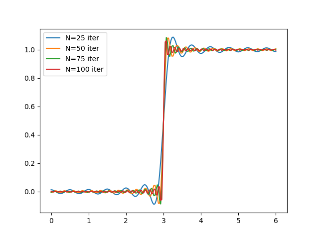

### Directions
Solve the following problems and write up your solutions.  Your solutions should be provided in one of the following formats (in order of preference)
* typed up in $$\LaTeX$$ and submitted as a PDF on Canvas
* written legibly on blank paper, scanned into a PDF and then uploaded on Canvas
* written on ancient parchement with a quill and then flown to the instructor via owl post like in Harry Potter

If you go with the first strategy, you may wish to check out Overleaf which is a free and intuitive website for generating $$\LaTeX$$ documents online.
If you wish to use the second method and don't own a scanner at home, you can check out the numerous scanning apps available for smartphones.

You will be graded based on *completion* of all of the assigned problems, along with in-depth grading of *select* problems which will not be revealed until after the homework is graded.

**Remember:** Success in any math class is based on *practice*.  The assigned homework problems are the **bare minimum**.  You should strive to do as many problems as possible from the textbook.

# Problem 1

Consider the first-order linear partial differential equation

$$yu_x - xu_y = 0$$

* (a) Use the **method of characteristics** to find the general solution of this equation.
* (b) Find a solution of the equation satisfying the property that $$u(x,0) = e^{-x^2}$$ for all $$x\in\mathbb{R}$$.

**Solution:**

The characteristic curves are defined by

$$\frac{dy}{dx} = \frac{-x}{y}.$$

This equation is separable.  Solving it the usual way, we get $$x^2 + y^2 = C$$, so the general solution is

$$u(x,y) = f(x^2+y^2).$$

The solution satisfying the desired initial condition is obtained by taking $$f(z) = e^{-z}$$, so that

$$u(x,y) = e^{-(x^2+y^2)}.$$

# Problem 2

Prove the following orthogonality relations for sine and cosine.

* (a) $$\int_0^T \sin(2\pi m t/T)\cos(2\pi n t/T) = 0$$ for all $$m,n\geq 0$$
* (b) $$\int_0^T \sin(2\pi m t/T)\sin(2\pi n t/T) = (T/2)\delta_{m,n}$$ for all $$m\geq 0,\ n > 0$$
* (c) $$\int_0^T \cos(2\pi m t/T)\cos(2\pi n t/T) = (T/2)\delta_{m,n}$$ for all $$m\geq 0,\ n > 0$$

**Solution:**

Assume $$m\neq n$$ and $$m+n\neq 0$$.  Then
$$\begin{align}
\int_0^T \sin(2\pi m t/T)\cos(2\pi n t/T)dt
 & = \frac{1}{2}\int_0^T \sin(2\pi (m+n) t/T) + \sin(2\pi (m-n) t/T)dt\\
 & = \left(\frac{-1}{2\pi(m+n)/T}\cos(2\pi (m+n) t/T) + \frac{-1}{2\pi(m-n)/T}\cos(2\pi (m-n) t/T)\right|_0^T = 0.
\end{align}$$

$$\begin{align}
\int_0^T \sin(2\pi m t/T)\sin(2\pi n t/T)dt
 & = \frac{1}{2}\int_0^T \cos(2\pi (m+n) t/T) - \cos(2\pi (m-n) t/T)dt\\
 & = \left(\frac{1}{2\pi(m+n)/T}\sin(2\pi (m+n) t/T) + \frac{-1}{2\pi(m-n)/T}\sin(2\pi (m-n) t/T)\right|_0^T = 0.
\end{align}$$

$$\begin{align}
\int_0^T \cos(2\pi m t/T)\cos(2\pi n t/T)dt
 & = \frac{1}{2}\int_0^T \cos(2\pi (m+n) t/T) + \cos(2\pi (m-n) t/T)dt\\
 & = \left(\frac{1}{2\pi(m+n)/T}\sin(2\pi (m+n) t/T) + \frac{1}{2\pi(m-n)/T}\sin(2\pi (m-n) t/T)\right|_0^T = 0.
\end{align}$$

Moreover, if $$m=n > 0$$, then 

$$\int_0^T \sin(2\pi n t/T)\cos(2\pi n t/T)dt = \frac{T}{2\pi n}\sin(2\pi nt / T)|_0^T = 0.$$

$$\int_0^T \sin^2(2\pi n t/T)dt = \int_0^T \frac{1}{2}-\frac{1}{2}\cos(4\pi n t/T)dt = \frac{T}{2}.$$

$$\int_0^T \cos^2(2\pi n t/T)dt = \int_0^T \frac{1}{2}+\frac{1}{2}\cos(4\pi n t/T)dt = \frac{T}{2}.$$

# Problem 3

Consider the function

$$f(x) = \left\lbrace\begin{array}{cc}
0 & 0\leq x < 3\\
1 & 3\leq x \leq 6
\end{array}\right.$$

* (a) Calculate the cosine series expansion of $$f(x)$$ on the interval $$[0,6]$$.
* (b) Plot the function $$f(x)$$ versus the partial sums $$A_0 + \sum_{n=1}^N A_n\cos(n\pi x/6)$$ of the cosine series expansion of $$f(x)$$ on $$[0,6]$$ for $$N = 25, 50, 75$$, and $$N = 100$$.
* (c) What is happening in the plots of (b) at the special point $$x=3$$?

**Solution:**

The coefficients of the cosine series expansion of $$f(x)$$ are given by

$$A_0 = \frac{1}{6}\int_3^6 = \frac{1}{2},$$

and for $$n>0$$

$$A_n = \frac{2}{6}\int_3^6\cos(n\pi x/6) = \frac{2}{n\pi}\sin(n\pi x/6)\vert_3^6 = \frac{-2}{n\pi} \sin(n\pi/2).$$

The code for plotting this solution for various values of $$N$$ can be found here.
* [python source code](python/hw1-part3.py)

At the special point where the initial function has a discontinuity, we have the Gibb's Phenomenon, where as we increase $$N$$, the peaks of waves get higher and higher near the boundary, even though the function acually converges pointwise everywhere to the function that we want away from $$x=3$$.
This is a good example of pointwise convergence but not uniform convergence.

# Problem 4

Find an explicit expression for the solution of the boundary value problem

$$T_t = kT_{xx},\ \ T_x(0,t) = 0,\ T_x(L,t) = 0,\ T(x,0) = x^2(L-x)^2.$$ 

What does the function $$T(x,t)$$ limit to as $$t\rightarrow\infty$$?

**Solution:**

Since the initial condition is a Neumann boundary condition, we need to use cosine series.
We are We start by calculating the cosine series expansion of $$x^2(L-x)^2$$

$$A_0 = \frac{1}{L}\int_0^L x^2(L-x)^2dx = \frac{L^4}{30}.$$

$$A_n = \frac{2}{L}\int_0^L x^2(L-x)^2\cos\frac{n\pi x}{L}dx = \frac{-24L^4(1+(-1)^n)}{\pi^4n^4}.$$

Our solution is then

$$u(x,t) = \sum_{n=0}^\infty A_ne^{-n^2\pi^2 kt^2/L^2}\cos(n\pi x/L) = \sum_{n=0} \frac{-24L^4(1+(-1)^n)}{\pi^4n^4}e^{-n^2\pi^2 kt^2/L^2}\cos(n\pi x/L).$$

