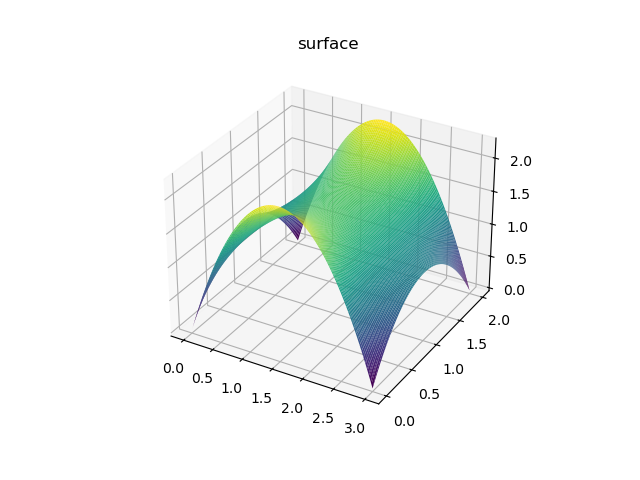
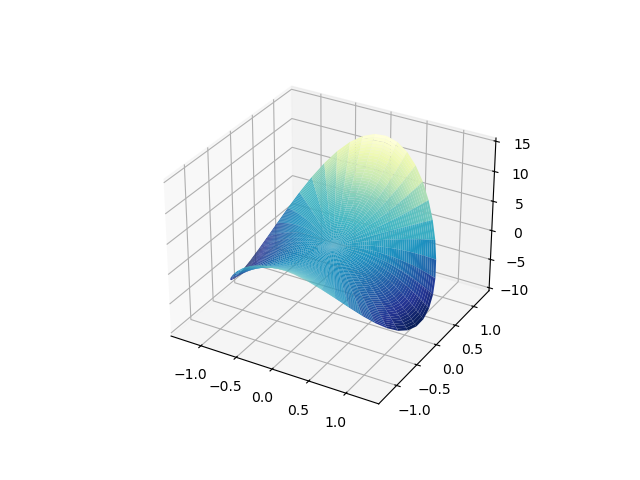
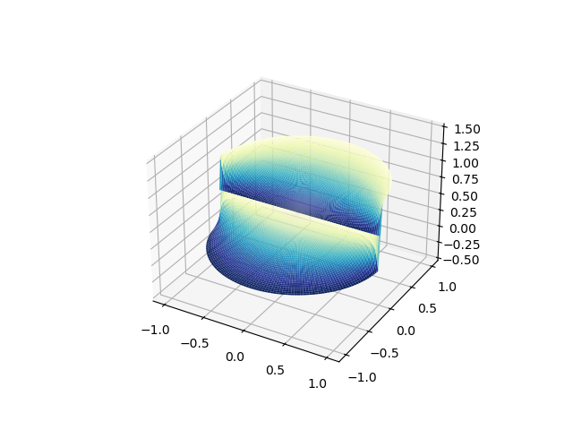

### Directions
Solve the following problems and write up your solutions.  Your solutions should be provided in one of the following formats (in order of preference)
* typed up in $$\LaTeX$$ and submitted as a PDF on Canvas
* written legibly on blank paper, scanned into a PDF and then uploaded on Canvas
* written on ancient parchement with a quill and then flown to the instructor via owl post like in Harry Potter

If you go with the first strategy, you may wish to check out Overleaf which is a free and intuitive website for generating $$\LaTeX$$ documents online.
If you wish to use the second method and don't own a scanner at home, you can check out the numerous scanning apps available for smartphones.

You will be graded based on *completion* of all of the assigned problems, along with in-depth grading of *select* problems which will not be revealed until after the homework is graded.

**Remember:** Success in any math class is based on *practice*.  The assigned homework problems are the **bare minimum**.  You should strive to do as many problems as possible from the textbook.

# Problem 1

Solve Laplace's equation

$$u_{xx} + u_{yy} = 0$$

on the rectangle $$0 < x < L$$ and $$0 < y < M$$

with the Dirichlet boundary conditions

$$u(x,0) = x(L-x),\ \ u(x,M) = x(L-x),\ \ u(0,y) = y(M-y),\ \ y(L,y) = y(M-y).$$

Then use a computer to create a contour plot of your solution and include the plot with your answer.
Hint: for this part, you might consider using MATLAB or Python or potentially adapting the code from lecture.

**Solution:**

Since we are using Dirichlet boundary conditions, we want t use the sine series expansions of $$x$$ and $$y$$.
We calculate

$$B_n = \frac{2}{L}\int_0^L x(L-x)\sin(n\pi x/L)dx = \frac{4L^2}{n^3\pi^3}(1-(-1)^n).$$

Using this, we calculate
$$\begin{align}
u(x,y)
  & = \sum_{n=1}^\infty \frac{4L^2(1-(-1)^n)}{n^3\pi^3\sinh(n\pi M/L)}\sin\left(\frac{n\pi x}{L}\right)\sinh\left(\frac{n\pi (M-y)}{L}\right)\\
  & + \sum_{n=1}^\infty \frac{4L^2(1-(-1)^n)}{n^3\pi^3\sinh(n\pi M/L)}\sin\left(\frac{n\pi x}{L}\right)\sinh\left(\frac{n\pi y}{L}\right)\\
  & + \sum_{n=1}^\infty \frac{4M^2(1-(-1)^n)}{n^3\pi^3\sinh(n\pi L/M)}\sin\left(\frac{n\pi y}{M}\right)\sinh\left(\frac{n\pi (L-x)}{M}\right)\\
  & + \sum_{n=1}^\infty \frac{4M^2(1-(-1)^n)}{n^3\pi^3\sinh(n\pi L/M)}\sin\left(\frac{n\pi y}{M}\right)\sinh\left(\frac{n\pi x}{M}\right)
\end{align}$$

The code for plotting this solution for various values of $$N$$ can be found here.
* [python source code](python/hw3-part1.py)

# Problem 2

Solve Laplace's equation 

$$u_{xx} + u_{yy} = 0$$

ono the disk $$x^2 + y^2\leq R^2$$ with the Dirichlet boundary condition 

$$u = 1 + 3\sin\theta - 5\cos(2\theta)$$

Then use a computer to create a contour plot of your solution and include the plot with your answer.

Hint: use the fundamental solutions in polar coordinates.

**Solution:**

We have that

$$u(r,\theta) = \sum_{n=0}^\infty A_n \left(\frac{r}{R}\right)^n \cos(n\theta) + \sum_{n=1}^\infty B_n \left(\frac{r}{R}\right)^n \sin(n\theta),$$

where here the $$A_n$$ and $$B_n$$ come from the Fourier series of the boundary condition.  Using orthogonality of trig functions:

$$A_0 = 1,\quad A_2 = -5,\quad B_1=3,$$

and $$A_n=0$$ and $$B_n=0$$ otherwise.  Thus the solution is

$$u(r,\theta) = 1 + 3\frac{r}{R}\sin\theta - 5\frac{r^2}{R^2}\cos(2\theta).$$

This can also be put back in terms of Cartesian coordinates as the simple polynomial

$$u(x,y) = 1 + \frac{3}{R}y + \frac{5}{R^2}(x^2+y^2) - \frac{10}{R^2}x^2.$$

The code for plotting this solution for various values of $$N$$ can be found here.
* [python source code](python/hw3-part2.py)

# Problem 3

Solve Laplace's equation 

$$u_{xx} + u_{yy} = 0$$

ono the disk $$x^2 + y^2\leq R^2$$ with the Dirichlet boundary condition 

$$u = \left\lbrace\begin{array}{cc}1 & 0\leq\theta\leq\pi\\0 & \pi <\theta<2\pi\end{array}\right.$$

Then use a computer to create a contour plot of your solution and include the plot with your answer.

Hint: use Poisson's kernel

**Solution:**

Using the Poisson kernel, we get the solution

$$\begin{align]
u(r,\theta)
  & = \frac{1}{2\pi}\int_0^{\pi} \frac{1-(r/R)^2}{1+(r/R)^2-2(r/R)\cos(\theta-\phi)}d\phi \\
  & = \frac{1}{\pi}\tan^{-1}\left(\frac{R+r}{R-r}\tan\frac{\pi-\theta}{2}\right) - \frac{1}{\pi}\tan^{-1}\left(\frac{R+r}{R-r}\tan\frac{-\theta}{2}\right)
\end{align}$$

The code for plotting this solution for various values of $$N$$ can be found here.
Careful when plotting this!  The function $$\tan(x)$$ is $$\pi$$-periodic, so we need to add a factor of $$\pi$$ after we go past a particular quadrant, in order to choose the right **branch** of the inverse function and get a continuous plot.  This is done in our python code.

* [python source code](python/hw3-part3.py)

# Problem 4

Prove **Harnack's Inequality** which states that if
$$u(x,y)$$ is a non-negative harmonic in a domain $$\Omega\subseteq\mathbb{R}^2$$ containing the disk

$$D_R(a,b) = \{(x,y)\in\mathbb R^2: (x-a)^2 + (y-b)^2 < R^2\}$$

and if $$u(x,y)$$ extends to a continuous function on the boundary of the disk, then for any  $$(x,y)\in D_R(a,b)$$ we have

$$\frac{1-r/R}{1 + r/R} u(a,b)\leq u(x,y)\leq \frac{1+r/R}{1 - r/R} u(a,b)$$

where here $$r = \sqrt{(x-a)^2+(y-b)^2}$$.

Hint: use both the Poisson kernel and the Mean Value Property.

**Solution:**

Let $$v(x,y) = u(x+a,y+b)$$, so that $$v$$ is a non-negative harmonic function on the disk $$D_R(0,0)$$. 
Switching to polar coordinates and applying the Poisson kernel, we see

$$\begin{align}
v(r,\theta)
  & = \frac{1}{2\pi}\int_0^{2\pi} \frac{1-(r/R)^2}{1+(r/R)^2-2(r/R)\cos(\theta-\phi)}v(R,\phi)d\phi\\
  & \leq \frac{1}{2\pi}\int_0^{2\pi} \frac{1-(r/R)^2}{1+(r/R)^2-2(r/R)}v(R,\phi)d\phi\\
  & = \frac{1}{2\pi}\int_0^{2\pi} \frac{1+(r/R)}{1-(r/R)}v(R,\phi)d\phi\\
  & = \frac{1+(r/R)}{1-(r/R)}\frac{1}{2\pi}\int_0^{2\pi} v(R,\phi)d\phi\\
  & = \frac{1+(r/R)}{1-(r/R)} v(0,0)
\end{align}$$

where the last inequality follows from the Mean Value Property for harmonic functions.
Likewise

$$\begin{align}
v(r,\theta)
  & = \frac{1}{2\pi}\int_0^{2\pi} \frac{1-(r/R)^2}{1+(r/R)^2-2(r/R)\cos(\theta-\phi)}v(R,\phi)d\phi\\
  & \geq \frac{1}{2\pi}\int_0^{2\pi} \frac{1-(r/R)^2}{1+(r/R)^2+2(r/R)}v(R,\phi)d\phi\\
  & = \frac{1}{2\pi}\int_0^{2\pi} \frac{1-(r/R)}{1+(r/R)}v(R,\phi)d\phi\\
  & = \frac{1-(r/R)}{1+(r/R)}\frac{1}{2\pi}\int_0^{2\pi} v(R,\phi)d\phi\\
  & = \frac{1-(r/R)}{1+(r/R)} v(0,0)
\end{align}$$

Thus in Cartesian coordinates with $$r = \sqrt{x^2+y^2}$$, we see

$$\frac{1-r/R}{1 + r/R} v(0,0)\leq v(x,y)\leq \frac{1+r/R}{1 - r/R} v(0,0).$$

Inserting back in terms of $$u$$, we get Harnack's inequality.

# Problem 5

Use Harnack's inequality to prove **Liouville's Theorem** which states that if $$u(x,y)$$ is a harmonic function on all of $$\mathbb{R}^2$$ and $$u(x,y)$$ is either bounded above or bounded below, then $$u(x,y)$$ is constant.

**Solution:**

If $$u$$ is bounded below by some constant $$c$$, define $$v = u-c$$.
Otherwise, if $$u$$ is bounded above by $$c$$, define $$v = c-u$$.
In any case, $$v$$ is a harmonic function and $$v\geq 0$$, so on any circle of radius $$R > 0$$, we can apply Harnack's inequality:

$$\frac{1-r/R}{1 + r/R} v(0,0)\leq v(x,y)\leq \frac{1+r/R}{1 - r/R} v(0,0).$$

Taking the limit as $$R\rightarrow\infty$$, we find

$$v(0,0)\leq v(x,y)\leq v(0,0)$$

and therefore $$v(x,y) = v(0,0)$$ for all $$(x,y)\in\mathbb{R}^2$$.
Hence $$v$$ is constant and it follows that $$u$$ is constant.

