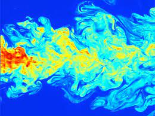

# Basic Examples of PDEs

A **partial differential equation** (PDE) is a differential equation which defines a relationship between a function and its **partial derivatives**.
While we will be interested in general with establishing a general theory of these equations, the historical foundations of PDEs makes us especially interested in three main examples whose origins come from the physics of heat transfer, wave motion, and electrodynamics.

Notationally, there are many different ways of expressing partial derivatives and in practice we will use many of these interchangeably.  For example $$\frac{\partial u}{\partial x}$$, $$\partial_x u$$, $$\frac{\partial}{\partial x}u$$ and $$u_x$$ will all be ways that we express partial derivatives.

A good part of this course will revolve around methods to solve these equations, or at least represent their solutions as infinite series, along with numerical methods of approximating solutions.

## The Heat Equation / Diffusion Equation

The **heat equation** or **diffusion equation** describes how the temperature of the surface of a material $$T(x,y,t)$$ in three dimensional space at position $$(x,y)$$ and time $$t$$ changes.  Intuitively, heat spreads out from very hot spots and migrates toward very cold spots, so in particular the value of $$T$$ will change over time.  Exactly how this change happens can be described by **Fourier's Law**, which says that the change will be proporional to the negative temperature gradient.
In particular it satisfies the two-dimensional heat equation

$$T_t = -k (T_{xx} + T_{yy})$$

The constant $$k$$ appearing in this equation is called the *thermal conductivity* and is a property of the material whose temperature we are studying.
This sort of equation arises in many more contexts then heat, such as Brownian motion in probability theory.

## The Wave Equation

The **wave equation** describes the motion of waves in space over time.
Waves arise naturally in a huge variety of situations, from guitar strings to sound waves to fluid flows to quantum physics.
As an example, suppose that you've filled a bathtub full of water, which you slosh around gently and then observe.  We will ignore the complicated physics induced by the presence of nonlinear phenomena, rubber ducks, etc.  The height $$h(x,y,t)$$ of the water at position $$(x,y)$$ and time $$t$$ obeys the two-dimensional wave equation

$$\frac{\partial^2 h}{\partial t^2} = c^2\left(\frac{\partial^2 h}{\partial x^2} + \frac{\partial^2 h}{\partial y^2}\right)$$

where here $$c$$ is the *propagation speed*, describing how fast peaks (or troughs) move.

## Poisson's Equation

**Poisson's Equation** describes gravitational or electric fields created by the presence of mass or electrical charge.
To get a basic idea, imagine we lay hands on an astronaut suit or whatever other outer space-ready environmental protection gear we have on hand (let me take a moment to apologize to my pet fish who was evicted from their tank for need of a helmet) and launch into the cosmos.
In the vaccuum around us we observe several large, misshapen bodies.
What kinds of attraction (of an appropriate, gravitational nature) do we experience toward these bodies?

We can describe how much mass is at what location in space using a function $$\rho(x,y,z)$$, called the *mass density*.
It works so that if we integrate $$\varphi$$ over a particular region of space, it returns the total mass inside that volume.

Now, it turns out that the *gravitational force* $$F$$ that we experience is the vector

$$\vec F = -m\nabla\varphi = \langle -m\varphi_x,-m\varphi_y,-m\varphi_z\rangle$$

defined by the gradient of a certain function $$\varphi(x,y,z)$$ called the *gravitation potential*, times our own mass $$m$$.
The gravitational potential satisfies the three-dimensional Poisson equation

$$\varphi_{xx} + \varphi_{yy} + \varphi_{zz} = 4G \rho.$$

The constant $$G$$ is called the *universal gravitational constant*.

In the case that $$\rho=0$$, Poisson's equation is also called **Laplace's Equation**

$$\varphi_{xx} + \varphi_{yy} + \varphi_{zz} = 0.$$

Eigenfunctions of Laplace's equation are called **harmonic functions**.

# Other kinds of PDEs

All of the previous examples of PDEs are examples of second-order linear partial differential equations.
However, they are nowhere near a comprehensive representation of the world of PDEs as a whole.

## Other linear equations

There are many, many other examples of linear partial differential equations that are important in other parts of mthematics, other than those listed above.

### Quantum mechanics

The **Schrodinger Equation** is a nonlinear partial differential equation describing the wave function $$\psi(x,y,t)$$ whose absolute value squared describes the probability density function of a particle of mass $$m$$ in the $$x,y$$-plane experiencing an external potential $$V(x,y,t)$$:

$$i\hbar\frac{\partial\psi}{\partial t}  = -\frac{\hbar^2}{2m} \left(\frac{\partial^2\psi}{\partial x^2} + \frac{\partial^2\psi}{\partial y^2}\right) + V\psi.$$

The constant $$\hbar$$ is called Planck's constant.

### Advection equation

If we scatter some dye into a fluid, the velocity of the fluid will spread the dye around over time.
If the velocity of the fluid in the $$x$$ and $$y$$ directions at position $$(x,y)$$ and time $$t$$ are given by $$u(x,y,t)$$ and $$v(x,y,t)$$, respectively, then the density $$\rho(x,y,t)$$ of the fluid satisfies the two-dimensional **advection equation**

$$\frac{\partial\rho}{\partial t} + u\frac{\partial\rho}{\partial x} + v\frac{\partial\rho}{\partial y} + (u_x+v_y)\rho = 0.$$

## Nonlinear PDEs

A partial differential equation is called **linear** if no powers or products or more complicated functions of the unknown function and its derivatives are present.
When such things appear, the partial differential equation is called **nonlinear**.

### KdV equation

The **Korteweg-De Vries Equation** is a one-dimensional model describing the motion of shallow water in a channel with some symmetry assumptions.
The height $$\phi(x,t)$$ at position $$x$$ and time $$t$$ is modeled the partial differential equation

$$\partial_t\phi + \partial_x^3\phi - 6\phi\partial_x\phi = 0.$$

The nonlinearity of this equation comes from the presence of the product of a function $$\phi$$ with it's $$x$$-derivative $$\partial_x\phi$$.

## Systems of PDEs

Often, it is not possible to describe the behavior of a physical system with a single function whose value satisfies a single PDE.
Instead, one often needs to deal with several unknown functions which are interdependent and simultaneously satisfy a combination of PDEs, which we call a **system**.

### Incompressible Navier-Stokes

The **Incompressible Navier-Stokes Equation** is a system of PDEs which models the motion of a fluid in three-dimensional space, in situations where the density at each point is the same and the divergence of the velocity field is zero.
This is a good model for something like water in a glass, since it takes a lot of force to squeeze water to any significant degree.
To describe the state of the fluid at each point $$(x,y,z)$$ and time $$t$$, we need four functions
* the velocity $$u(x,y,z,t)$$ of the fluid in the $$x$$-direction
* the velocity $$v(x,y,z,t)$$ of the fluid in the $$y$$-direction
* the velocity $$w(x,y,z,t)$$ of the fluid in the $$z$$-direction
* the local pressure $$p(x,y,z,t)$$ of the fluid

$$\begin{align*}
u_t + uu_x + vu_y + wu_z - \nu (u_{xx}+u_{yy}+u_{zz}) &= -\frac{1}{\rho}p_x + \varphi_x\\
v_t + uv_x + vv_y + wv_z - \nu (v_{xx}+v_{yy}+v_{zz}) &= -\frac{1}{\rho}p_y + \varphi_y\\
w_t + uw_x + vw_y + ww_z - \nu (w_{xx}+w_{yy}+w_{zz}) &= -\frac{1}{\rho}p_z + \varphi_z\\
u_x^2 + v_y^2 + w_z^2 + 2v_xu_y + 2w_xu_z + 2w_yv_z   & = \frac{1}{-\rho}(p_{xx} + p_{yy} + p_{zz})
\end{align*}$$

Here $$\rho$$ is the density of the fluid and $$\nu$$ is the coefficient of kinematic viscosity.
The extra function $$\varphi$$ represents external forces imposed by various fields (gravity, electricity, etc).

