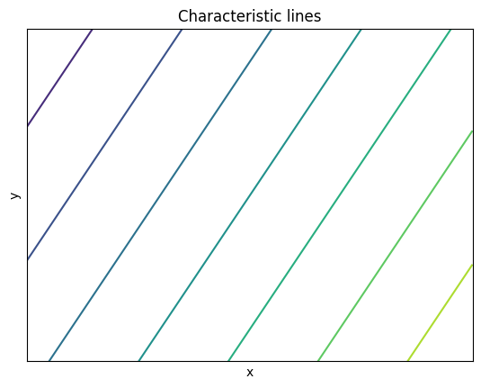
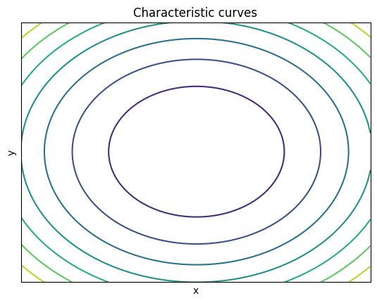
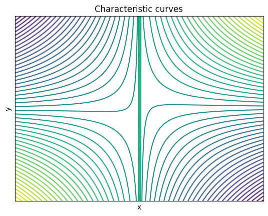
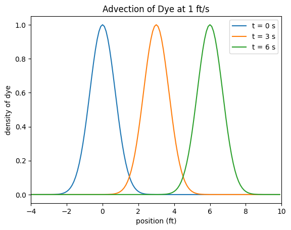

# Basic Definition

A **first-order linear** partial differential equation is a partial differential equation of the form

$$a(x,y)u_x + b(x,y)u_y + g(x,y)u = f(x,y)$$

in two dimensions, and 

$$a(x,y,z)u_x + b(x,y,z)u_y + c(x,y,z)u_z + g(x,y,z)u = f(x,y,z)$$

in three dimensions (and so on), where $$a,b,c$$ and $$f$$ are some functions which are given and $$u$$ is our unknown function which we want to solve for.
The function on the right-hand side is sometimes referred to as the **forcing function**.
In the special case that $$f(x,y,z)$$ is identically zero, this equation is called **homogeneous**.  Otherwise, it is called **inhomogeneouos**.

:warning:  Many different kinds of things are called homogeneous in mathematics, especially in PDEs where we have homogeneous equations, homogeneous boundary conditions, homogeneous spaces, ... Be careful to understand what *kind* of homogeneous we are talking about in any situation.

This kind of differential equation arises naturally, when we consider the process of **advection**, where a material is moved around a medium (like a fluid or gas) due to the local motion of the medium itself.
Imagine for example, we have a cup of coffee that we add a bit of sugar to, before stirring it up.
If $$U(x,y,z,t)$$, $$V(x,y,z,t)$$, and $$W(x,y,z,t)$$ are the velocity of the coffee at time $$t$$, then the density of the sugar $$\rho(x,y,z,t)$$ is modeled by the **advection equation**

$$\rho_t + U\rho_x + V\rho_y + W\rho_z = 0.$$

[Note: this ignores other phenomena, such as diffusion]

## Homogeneous with constant coefficients

The simplest situation we can consider is the case of a **first-order homogeneous PDE with constant coefficients**, ie. when the coefficients of the unknown function $$u$$ are constants and the.

For example, we can consider trying to find solutions of the differential equation

$$au_x + bu_y = 0$$

for some constants $$a$$ and $$b$$.  How can we solve this?

One idea is to think about this differential equation as the action of a directional derivative on the function $$u$$.
Back in multivariable calculus, we learned that the derivative of a function in the direction of a vector $$\vec v = \langle a,b\rangle$$ is given by

$$D_{\vec v}(u) = au_x + bu_y.$$

Thus our equation is really simply saying that the directional derivative of $$u$$ in the direction of $$\vec v$$ must always be $$0$$.  In other words, $$u$$ will be *constant* along the parametric lines 

$$x = x_0 + at,\ \ y = y_0 + bt,\ \ t\in\mathbb{R}$$

for any $$(x_0,y_0)\in\mathbb R^2$$.
These lines are called **characteristic lines**.

In particular, this means that the value of a solution $$u(x,y)$$ everywhere will be determined by the values of $$u(x,y)$$ on the $$x$$-axis.
In particular, if we assume $$u(x,0) = f(x)$$ for each $$x\in\mathbb{R}$$, then to 
figure out the value of $$u(x_0,y_0)$$, we just trace along a characteristic line to the point $$(x_0-ay_0/b,0) = f(x_0-ay_0/b)$$ on the $$x$$-axis.  Thus for all $$x,y$$

$$u(x,y) = f(x-ay/b).$$

Plugging this into our original PDE, we see that for any first differentiable function $$f(x)$$ defines a solution.

## Homogeneous with nonconstant coefficients

The next more complicated situation is the case of a **first-order homogeneous PDE** with non-constant coefficients.
For example, we can consider the differential equation

$$yu_x - xu_y = 0.$$

Again, we can interpret this differential equation in terms of directional derivatives.  Specifically, we are looking for a function $$u(x,y)$$ whose derivative in the direction of $$\langle y,-x\rangle$$ at the point $$(x,y)$$ is always zero.
As a natural generalization of last time, we want to consider curves in the $$x,y$$-plane on which $$u(x,y)$$ is constant, ie. parametric curves

$$x = x(t),\ \ y = y(t)$$

whose tangent vectors are always in the direction of $$\langle y,-x\rangle$$.
This leads to the system of first order *ordinary* differential equations

$$\begin{align*}
\frac{dx}{dt} &= -y\\
\frac{dy}{dt} &=  x
\end{align*}$$

Combining these two equations leads to the second order ordinary differential equation

$$\frac{d^2x}{dt^2} + x = 0,$$

which has the particular solution $$x = A\cos(t)$$.  This also gives $$y = -\frac{dx}{dt} = A\sin(t)$$.
Thus the curves that $$u(x,y)$$ is constant on are circles centered around the origin.
We call these curves **characteristic curves**.

Once again, this says that the general solution of the differential equation will be determined by its values on the $$x$$-axis.  Specifically, if $$u(x,0) = f(x)$$ for all $$x$$, then to determine the value at an arbitrary point $$(x_0,y_0)$$ we travel around the circle of radius $$\sqrt{x_0^2+y_0^2}$$ until we get to the point $$(\sqrt{x_0^2+y_0^2},0)$.
In other words

$$u(x,y) = f(\sqrt{x^2+y^2}),$$

is a solution of our PDE for any choice of first differentiable function $$f$$.

# Method of Characteristics

The exmples above suggest a general method for solving homogeneous, first order linear PDEs, called the **method of characteristics**.

To solve the PDE

$$a(x,y)u_x + b(x,y)u_x = 0,$$

we want to find a family of **characteristic curves** with the property that $$u$$ restricted to each curve is constant.
If $$x = x(t)$$ and $$y = y(t)$$ is a parametrization of a level curve, then this means
$$x(t)$$ and $$y(t)$$ satisfy the system of ODEs

$$\begin{align*}
\frac{dx}{dt} &= u(x,y)\\
\frac{dy}{dt} &= v(x,y)
\end{align*}$$

or equivalently the single ODE

$$\frac{dy}{dx} = \frac{v}{u}.$$

If the general solution of this ODE is

$$\eta(x,y) = \text{constant},$$

then for any first differentiable function $$f$$, the function

$$u(x,y) = f(\eta(x,y))$$

solves our PDE.

## Another example

Consider the PDE

$$xu_x + (x+y)u_y = 0.$$

To use the method of characteristics, we need to solve the differential equation

$$\frac{dy}{dx} = 1 + \frac{y}{x}.$$

This is an example of a *nonlinear homogeneous ODE* and is solved by performing the substitution $$z=y/x$$ and $$\frac{dy}{dx} = z + x\frac{dz}{dx}$$, which after simplification reduces the equation to

$$\frac{dz}{dx} = \frac{1}{x},$$

whose general solution is $$z = \ln\lvert x\rvert +C$$.  Thus our level curves are given by the equation

$$\frac{y}{x} -\ln\lvert x\rvert = C$$

Thus solutions of our family of PDEs are given by

$$u(x,y) = f(y/x-\ln\lvert x\rvert ).$$

## Physical intuition
The fact that an arbitrary function keeps showing up shouldn't be too surprising.
It should be viewed as a sort of "boundary condition", describing what the solution is at a particular boundary.
If we add in time, we can alternatively view it as a sort of "initial condition" for the initial state of the system before time moves forward.

Suppose we observe some water flowing down a channel at a constant rate $$U > 0$$.
Suppose we dump some dye into the channel, so that $$\rho(x,t)$$ describes the density of the dye at position $$x$$ and time $$t$$.
Then $$\rho$$ satisfies the advection equation

$$\rho_t +U\rho_x = 0,$$

which is a second-order homogeneous linear PDE with constant coefficients.
As we saw above, the solution of this PDE is 

$$\rho(x,t) = f(x-t/U)$$

for some function $$f$$.  Now $$\rho(x,0) = f(x)$$, so the function $$f(x)$$ is simply the density of the dye at the starting time.
The fact that we are allowed to use an arbitrary function $$f$$ just means that we are able to model the behavior of the motion of the dye for all kinds of initial conditions!

Moreover, if we are travelling at a velocity of $$U$$ for a time $$t=T$$, the distance we have traveled will be $$U/T$$.
At time $$T$$, the distribution of the dye is $$\rho(x,) = f(x-T/U)$$, which is the same function as before just shifted to the *right*  by the distance $$T/U$$.
The density is the same, its just been moved down an appropriate distance.
For this reason, the advection equation is also sometimes called the **transport equation**.

