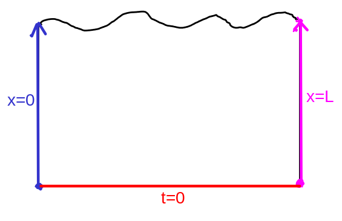

# Types of boundary conditions

Boundary conditions in PDEs play the same role as initial conditions in ordinary differential equations.

Suppose we have the heat equation

$$T_t = kT_{xx},$$

describing the evolution of the temperature of a metal bar of length $$L$$.
It makes sense to restrict the $$x$$-values we consider to the interval $$[0,L]$$,
and the range of times to be $$[0,\infty)$$, with $$t=0$$ being the initial time.
In other words, we care about solving the heat equation in the rectangular region $$[0,L]\times [0,\infty)$$ of the $$x,t$$-plane.

The boundary of such a  region consists of the lines
* $$t=0$$, the initial temperature profile (red)
* $$x=0$$, the left endpoints (blue)
* $$x=L$$, the right endpoints (pink)

Specifying what our solution $$T$$ should be on these three lines is called our **boundary condition**, and a PDE with a boundary condition is called a **boundary value problem**.
There are three basic kinds of boundry conditions that arise most commonly: Dirichlet, Neumann, and mixed boundary conditions.

### Dirichlet boundary conditions

Experimentally, we can imagine that at each end of the rod we use candles, ice, or something else to maintain specific desired temperatures at each end.
At the left end, we maintain a particular temperature $$T_0(t)$$, while at the right end we have the constant temperature $$T_1(t)$$.
If we observe the temperature profile at the starting time is $$T(x,0) = f(x)$$, this leads to the **Dirichlet boundary condition**

$$T(0,t) = T_0(t),\quad T(L,t) = T_1(t),\quad T(x,0) = f(x).$$

In the special case thata $$T_0 = T_1 = 0$$, this is called a **homogeneous Dirichlet boundry condition**.

### Neumann boundary conditions

Alternatively, we can imagine that we put insulators at each end of the rod which keep heat from exiting the tube.
This forces the *derivative* of the temperature at each end to be zero, leading to the **homogeneous Neumann boundary condition**

$$T_x(0,t) = 0,\quad T_x(L,t) = 0,\quad T(x,0) = f(x).$$

Again, in this case we are still expressing the initial temperature profile $$f(x)$$ at time $$t=0$$.
More generally, we can modify our experiment to allow a certian amount of heat flux at each end over time, leading to a nonhomogeneous **Neumann boundary condition** 

$$T_x(0,t) = h_0(t),\quad T_x(L,t) = h_1(t),\quad T(x,0) = f(x).$$

### Mixed boundary conditions

Last but not least, we can consider situtions where the above kinds of boundary conditions are mixed together, which we call **mixed boundary conditions**.
These might look like

$$T(0,t) = T_0(t),\quad T_x(L,t) = h_1(t),\quad T(x,0) = f(x).$$

or else

$$T_x(0,t) = h_0(t),\quad T(L,t) = T_1(t),\quad T(x,0) = f(x).$$

# Well-posedness

When we consider a boundary value problem, the first question we should ask ourselves is about existence and uniqueness.

**Question:** When does a solution of a boundary value problem exist, and if it exists when is it unique?

When there exists a unique solution of a boundary value problem, we call the problem **well-posed**.  As we will find out later, Dirichlet and Neumann boundary value problems are always well-posed (under very mild assumptions), but some kinds of mixed boundary value problems may not be well-posed!

