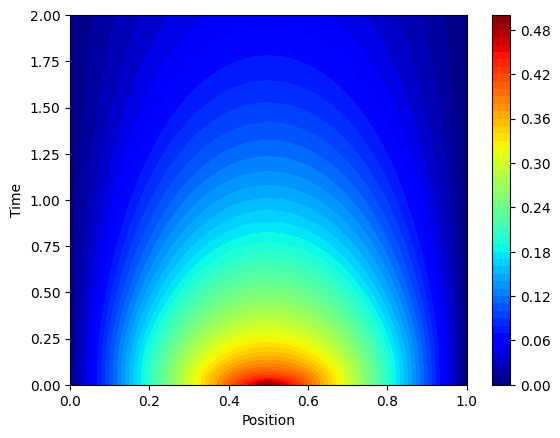

The previous solutions to the heat equation are not all solutions of the heat equation.
In particular, while they satisfy the boundary conditions at the endpoints, they fail to satisfy the initial condition $$T(x,0) = f(x)$$ for arbitrary values of $$f(x)$$.
Instead, the solutions we found in
* the Dirichlet case

$$T_n(x,t) = \sin\left(\frac{n\pi}{L}x\right)e^{-\frac{n^2\pi^2k}{L^2}t},\quad n = 1,2,3,\dots$$

* and the Neumann case

$$T_n(x,t) = \cos\left(\frac{n\pi}{L}x\right)e^{-\frac{n^2\pi^2k}{L^2}t},\quad n = 0,1,2,3,\dots$$

should be thought of as the *building blocks* of all solutions of the heat equation.
The key to finding other solutions of the heat equation and solving boundary value problems is the **superposition principle**.

**Theorem (Superposition Principle):**  If $$u$$ and $$v$$ are solutions of a linear PDE, then any linear combination of $$u$$ and $$v$$ is also a solution.

More generally, if we have a sequence of infinitely many solutions $$\{T_n(x,t)\}$$ then a series

$$T(x,t) = \sum A_n T_n(x,t)$$

will also define a solution where the sum converges.

# Sine and cosine series

To solve a general homogeneous Dirichlet or Neumann boundary condition, we need to borrow some tools from Fourier series.

### Sine series
Suppose that $$f(x)$$ is a function on $$[0,L]$$ with $$f(0) = f(L) = 0$$.
The **sine series expansion** for $$f(x)$$ is a sequence of constants $$B_n,\ n\geq 1$$ with the property that

$$f(x) = \sum_{n=1}^\infty B_n\sin\left(\frac{n\pi}{L}x\right),\ \forall x\in [0,L].$$

Using orthogonality of trigonometric integrals, we cn obtain an explicit formula for calculating the constants $$A_n$$.
In particular

$$B_n = \frac{2}{L}\int_0^L \sin\left(\frac{n\pi}{L}x\right)f(x)dx,\quad n\geq 1$$

### Cosine series
Alternatively, if $$f'(0) = f'(L) = 0$$, then we define the **cosine series expansion** of $$f(x)$$ to be a sequence of constants $$A_n,\ n\geq 0$$ with the property that

$$f(x) = \sum_{n=1}^\infty A_n\cos\left(\frac{n\pi}{L}x\right),\ \forall x\in [0,L].$$

In this case
$$A_0 = \frac{1}{L}\int_0^L f(x)dx,$$

and more generally

$$A_n = \frac{2}{L}\int_0^L \sin\left(\frac{n\pi}{L}x\right)f(x)dx,\quad n\geq 1$$

:warning: Notice the different formulas for $$B_0$$ vs. $$B_n$$!

# Solving homogeneous problems

Now suppose we want to solve the homogeneous Dirichlet boundary value problem

$$T(0,t) = 0,\quad T(L,t) = 0,\quad T(x,0) = f(x).$$

By the superposition principle, we know that

$$T(x,t) = \sum_{n=1}^\infty B_n\sin\left(\frac{n\pi}{L}x\right)e^{-\frac{n^2\pi^2k}{L^2}t},$$

is a solution of the heat equation satisfying the boundary conditions at the ends of the interval.
When $$t=0$$, this solution says

$$T(x,0) = \sum_{n=1}^\infty B_n\sin\left(\frac{n\pi}{L}x\right),$$

so if we choose the $$B_n$$'s to be the sine series expansion of $$f(x)$$, it satisfies the initial condition.

In exactly the same way, to solve the homogeneous Neumann boundary value problem

$$T_x(0,t) = 0,\quad T_x(L,t) = 0,\quad T(x,0) = f(x),$$

we use the coefficients $$A_0,A_1,A_2,\dots$$ of the cosine series expansion of $$f(x)$$ and take 

$$f(x) = \sum_{n=0}^\infty A_n\cos\left(\frac{n\pi}{L}x\right)e^{-\frac{n^2\pi^2k}{L^2}t},\ \forall x\in [0,L].$$

### Example

Let's solve the boundary value problem

$$u_t = ku_{xx},\quad T(0,t) = 0,\quad T(L,t) = 0,\quad T(x,0) = f(x).$$

for the function

$$f(x) = \left\lbrace
\begin{array}{cc}
x & 0 \leq x < L/2\\
L-x & L/2 \leq x \leq L\\
\end{array}\right..$$

Since this is a Dirichlet boundary condition, we use the sine series expansion.

The $$n$$'h coefficient is

$$B_n = \frac{2}{L}\int_0^L \sin\left(\frac{n\pi}{L}x\right)f(x)dx$$

By symmetry, this will be zero when $$n$$ is even.
Therefore, we can assume $$n$$ is odd. In this case

$$
\begin{align}
B_n
  & = \frac{2}{L}\int_0^L \sin\left(\frac{n\pi}{L}x\right)f(x)dx\\
  & = \frac{4}{L}\int_0^{L/2} x\sin\left(\frac{n\pi}{L}x\right)dx\\
  & = \frac{4}{L}\left[-x\frac{L}{n\pi}\cos\left(\frac{n\pi}{L}x\right) + \frac{L^2}{n^2\pi^2}\sin\left(\frac{n\pi}{L}x\right)\right\rvert_0^{L/2}\\
  & = \frac{-2L}{n\pi}\cos(n\pi/2) + \frac{4L}{n^2\pi^2}\sin(n\pi/2)\\
  & = \frac{4L}{n^2\pi^2}(-1)^{(n-1)/2}
\end{align}$$

Using these values for the $$B_n$$'s, our solution is

$$T(x,t) = \sum_{m=1}^\infty \frac{4L}{(2m+1)^2\pi^2}(-1)^{m} \sin\left(\frac{(2m+1)\pi}{L}x\right)e^{-\frac{(2m+1)^2\pi^2k}{L^2}t}.$$

A contour plot of the solution in the space-time plane is given below, along with a video showing the temperture with respect to position as time moves forward.
This animation was created using python, and code for its collaboration can be found and experimented with here.
* [Google collab of a numerical simulation of diffusion of a triangle](https://colab.research.google.com/drive/18tDYTKYZlfRaiIWIrohTyb-aAshx2C4w?usp=sharing)

<video controls="" width="700" height="500" muted="" loop="" autoplay="">
<source src="vid/005-triangle.mp4" type="video/mp4">
</video>

