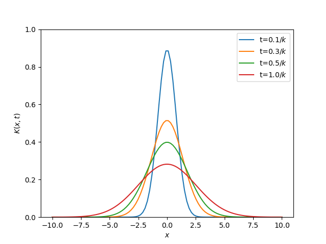

So far, we have looked at solutions of the heat equation where the spatial dimension is constrained to be an interval $$[0,L]$$.
However, in the real world we can certainly imagine situations where we are interested in solutions of the heat equation where the spatial dimension is unbound in this manner.
These situations typically occur when the spatial dimensions are so large that they might as well be taken to be infinite.

In this situation, there is no "boundary" (hence unbound), so our boundary value problems are replaced with **Cauchy problems**, which simply specify the initial condition.

$$u_t = ku_{xx},\ \ u(x,0) = f(x).$$

To solve the Cauchy problem, we use a new fundamental solution, called the heat kernel.

## Heat kernel

To solve the Cauchy problem for the homogeneous heat equation above, we take the Fourier transform of the entire expression above with respect to the spatial variable $$x$$.
This changes $$x$$ derivatives into multiplication by a polynomial!

$$\hat u_t = -4\pi^2\xi^2k\hat u,\ \ \hat u(\xi,0) = \hat f(\xi),$$

where here

$$\hat u(x,t) = \int_{\mathbb{R}} u(x,t)e^{-2\pi i\xi x}dx.$$

This is a simple first-order partial differential equation for $$\hat u$$!
The solution is

$$\hat u = e^{-4\pi^2k\xi^2 t}\hat f(\xi).$$

Using the inverse Fourier transform, which takes products to convolutions, we obtain

$$u(x,t) = \int_{\mathbb{R}} K(x-y,t)f(y)dy,$$

where here $$K(x,y)$$ is the inverse Fourier transform of a Gaussian:

$$K(x,t) = \frac{1}{\sqrt{4\pi kt}}e^{-x^2/(4\pi kt)}.$$

This very important function is called the heat kernel.

**Definition:** The one-dimensional **heat kernel** is the function

$$K(x,t) = \frac{1}{\sqrt{4\pi kt}}e^{-x^2/(4kt)},\ \ t > 0.$$

**Note:** The heat kernel itself is a solution of the heat equation for $$x\in\mathbb{R}$$ and $$t > 0$$, with the initial temperature being a Dirac delta distribution $$u(x,0) = \delta(x)$$.
In fact, one can prove that $$\lim_{t\rightarrow 0+} K(x,t)$$ converges weakly to $$\delta(x)$$.

To summarize, we have the following theorem:

**Theorem:**  Suppose $$f(x)$$ is a locally integrable function and $$\lvert f(x)\rvert \leq Ce^{rx}$$ for some constants $$C,r$$ (ie. $$f(x)$$ has subexponential growth).  Thn a solution of the Cauchy problem

$$u_t = ku_{xx},\ \ u(x,0) = f(x)$$

is given by

$$u(x,t) = \int_{\mathbb{R}} K(x-y,t)f(y)dy.$$

### Example

As a first example, consider the Cauchy problem

$$u_t = ku_{xx},\ \ u(x,0) = \left\lbrace\begin{array}{cc} 1 & x\geq 0\\0 & x < 0\end{array}\right.$$

The solution is

$$\begin{align}
u(x,t)
  &= \int_{\mathbb{R}} K(x-y,t)f(y)dy\\
  &= \int_0^\infty \frac{1}{\sqrt{4\pi kt}}e^{-(x-y)^2/(4kt)}dy\\
  &=  \frac{1}{\sqrt{4\pi kt}}\int_{-x}^\infty e^{-y^2/(4kt)}dy\\
  &=  \frac{1}{2}+\frac{1}{2}\text{erf}(x/\sqrt{4kt}),
\end{align}$$

where here $$\text{erf}(x)$$ is the **error function**

$$\text{erf}(x) = \frac{2}{\sqrt{\pi}}\int_0^x e^{-t^2}dt.$$

## Nonhomogeneous Cauchy problem

As a more general problem, we can ask ourselves how we might find a solution of a Cauchy problem for a nonhomogeneous heat equation

$$u_t = ku_{xx} + \phi(x,t),\ \ u(x,0) = f(x).$$

Again, we can take the Fourier transform, getting

$$\hat u_t = -4\pi^2\xi^2 k\hat u + \hat\phi(\xi,t),\ \ \hat u(\xi,0) = \hat f(\xi).$$

This is a **first-order linear ODE** in the variable $$t$$, so we multiply by the integrating factor $$\mu(t) = e^{4\pi^2\xi^2kt}$$.
Then the equation becomes

$$e^{4\pi^2\xi^2kt}\hat u_t = -4\pi^2\xi^2 ke^{4\pi^2\xi^2kt}\hat u + e^{4\pi^2\xi^2kt}\hat\phi(\xi,t).$$

Now grouping all of the $$u$$ terms together, we find

$$\frac{\partial}{\partial t}(e^{4\pi^2\xi^2kt}\hat u) = e^{4\pi^2\xi^2kt}\hat\phi(\xi,t).$$

Integrating with respect to $$t$$ and using our initial condition then gives

$$\hat u(x,t) = e^{-4\pi^2\xi^2kt}\int_0^t e^{4\pi^2\xi^2ks}\hat \phi(\xi,s)ds + e^{-4\pi^2\xi^2kt}\hat f(\xi).$$

Finally, applying the inverse Fourier transform gives

$$u(x,t) = \int_0^t \int_{\mathbb{R}} K(t-s,x-y)\phi(y,s)dsdy + \int_{\mathbb{R}} K(t,x-y)f(y)dy.$$

:warning:  The integral involving $$\phi$$ above may not exist, unless the growth of the functions $$f$$ and $$\phi$$ is bounded in some way.

To summarize, we have the following theorem.

**Theorem:** Suppose that $$f(x)$$ locally integrable and has subexponential growth, and that $$\phi(x,t)$$ decays sufficiently quickly as $$\lvert x\rvert$$ increases.
Then a solution of 

$$u_t = ku_{xx} + \phi(x,t),\ \ u(x,0) = f(x)$$

is given by

$$u(x,t) = \int_0^t \int_{\mathbb{R}} K(t-s,x-y)\phi(y,s)dsdy + \int_{\mathbb{R}} K(t,x-y)f(y)dy.$$

