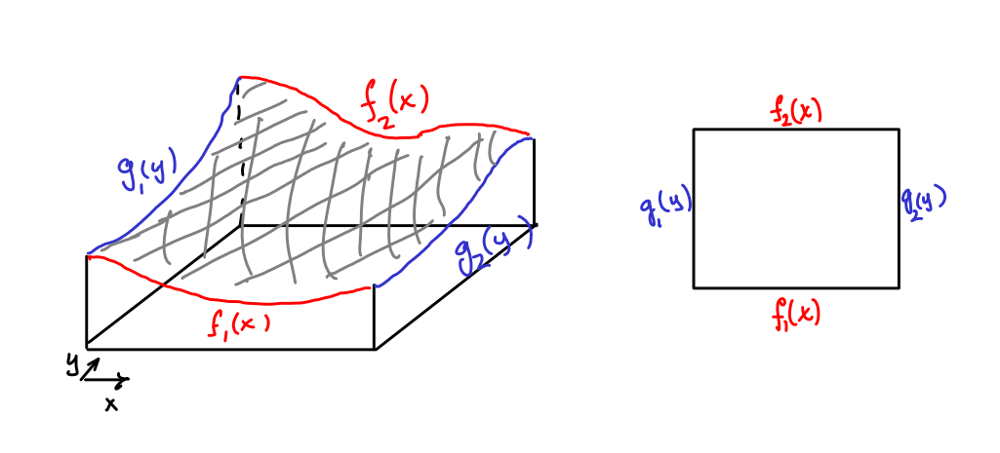

Laplace's equation in two dimensions is the PDE

$$u_{xx} + u_{yy} = 0$$

In three dimensions, it is given by

$$u_{xx} + u_{yy} + u_{zz} = 0.$$

Due to its auspicious role in physics, the operation of taking all the (non-mixed) second derivatives and adding them together has earned itself its own name.
It is called the **Laplacian** and is denoted by $$\Delta$$.
Thus Laplaces equation in *any* dimensions can be expressed simply as

$$\Delta u = 0.$$

## Harmonic functions

A solution $$u$$ of Laplace's equation $$\Delta u = 0$$ inside a domain $$\Omega\subseteq\mathbb{R}^n$$ is called a **harmonic function on $$\Omega$$**.
Inside $$\Omega$$, harmonic functions feature two important properties: the Mean Value Property and the Maximum Principle.

The value of a function which is harmonic in $$\Omega$$ is determined by the value of the function on the booundary $$\partial\Omega$$.
Geometrically in two dimensions, a harmonic function looks like what happens when you stretch rubber over a cut up tin can.
If we saw the sides of the box down so that the height at each point is $$f(x,y)$$, and then stretch our rubber as tight as possible, the surface we end up with is a solution of Laplaces equation.

In three dimensions, harmonic functions describe gravitatial fields in the empty spaces *between* massive objects like planets, or electric fields in the empty spaces away frmo the source of the electric charge.

## The Mean Value Property

Suppose that $$u$$ is a harmonic function on $$\Omega\subseteq\mathbb{R}^2$$.
The Mean Value Property says that for any $$(a,b)\in\Omega$$ and any radius $$r>0$$ where the disk

$$D_r(a,b) := \{(x,y): (x-a)^2 + (y-b)^2 < r^2\}$$

is contained in $$\Omega$$, the averge value of $$u$$ on the boundary of the disk will be equal to the value of $$u$$ at $$(a,b)$$.
Mathematically, this may be expressed as

$$\frac{1}{2\pi}\oint_0^{2\pi} u(a + r\cos(\theta),b + r\sin(\theta)) d\theta = u(a,b).$$

In three dimensions, this generalizes to the average over the surface of a ball being equal to the value at the center of the ball.
This generalizes to $$n$$ dimensions by replacing surface with hypersurface.

