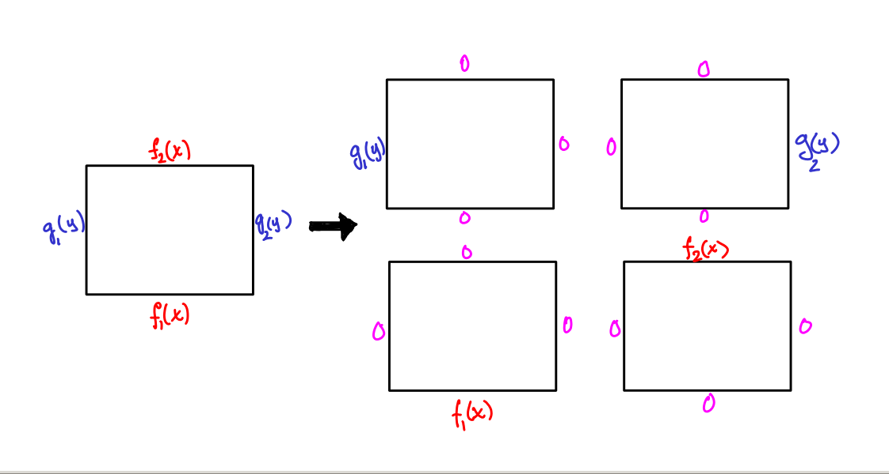

## Dirichlet problem on a rectangle

We want to find a solution of the Dirichlet boundary value problem for Laplace's equation on a rectangle

$$u_{xx} + u_{yy} = 0,\ \ u(x,0) = f_1(x),\ \ u(x,M) = f_2(x),\ \ u(0,y) = g_1(y),\ \ u(L,y) = g_2(y).$$

If we think back to the case of the heat equation, our strategy for doing this
is to use *separation of variables* in order to get a sequence of Fundamental
solutions to the homogeneous boundary value problem.

Our situation is simultaneously in many ways, but not quite the same, since we have two spatial dimensions and only one time dimension.
This makes what our analog of an "initial condition" somewhat unclear.
So what is the analog of a homogeneous boundary value problem?

The answer isn't to take it to be zero on all the boundaries, since the only solution to this is $$u(x,y) = 0$$.
Instead, what we do is take one side to be nonzero, and the remaining three to be zero.
By doing this for every side separately, we can add four separate solutions together to find a solution to any Dirichlet BVP.

In separation of variables, we propose a solution of the form $$u(x,y) = F(x)G(y)$$.
Inserting this into the above equation gives

$$F''(x)G(y) + F(x)G''(y) = 0.$$

We rewrite this as

$$F''(x)/F(x) = -G''(y)/G(y).$$

This means that both of them can be set equal to some constant.
Whether we want a positive or a negative constant depends on the boundary that we are aiming at taking to be nonzero.  (Alternatively, we can resign ourselves to working with complex numbers).

### Top boundary

Let's start by trying to find solutions which are zero on all boundaries but the top, ie.

$$u_{xx} + u_{yy} = 0,\ \ u(x,0) = 0,\ \ u(x,M) = f_2(x),\ \ u(0,y) = 0,\ \ u(L,y) = 0.$$

For this, we write

$$F''(x)/F(x) = -\lambda^2,\ \ \text{and}\ \ G''(y)/G(y) = \lambda^2.$$

Therefore

$$F(x) = A\cos(\lambda x) + B\sin(\lambda x).$$

and

$$G(x) = C\cosh(\lambda y) + D\sinh(\lambda y).$$

With the homogeneous boundary conditions $$u(0,y) = 0$$ and $$u(L,y) = 0$$, we get that $$A=0$$ and $$\lambda = n\pi/L$$.
Furthermore since $$u(x,0) = 0$$ we get $$C = 0$$, resulting in the **top boundary fundamental solutions**

$$u_n(x,y) = \sin\left(\frac{n\pi x}{L}\right)\sinh\left(\frac{n\pi y}{L}\right).$$

By the superposition principle, any linear combination of solutions is also a solution, so if we take the sine series expansion of $$f_2(x)$$ on $$[0,L]$$

$$f_2(x) = \sum_{n=1}^\infty B_n\sin\left(\frac{n\pi x}{L}\right)$$

then the combination of fundamental solutions

$$u_n(x,y) = \sum_{n=1}^\infty \frac{B_n}{\sinh(n\pi)}\sin\left(\frac{n\pi y}{L}\right)\cosh\left(\frac{n\pi x}{L}\right)$$

solves the top boundary BVP.

:warning: Notice the $$\sinh(n\pi)$$ term, which arises from matching with the desired initial condition.

### Other boundaries

To get solutions for the other three boundaries, we can set up the associated BVP as we just did and solve.  However, there is a much faster alternative.
We can exploit some of the symmetries of Laplace's equation which are simultaneously symmetries of the rectangle.
For example, if $$u(x,y)$$ is a solution of Laplace's equation, then so are the transformations

* the reflection $$u(x,L-y)$$
* the reflection plus rescaling $$u(Ly/M,Lx/M)$$
* the rotation plus rescaling $$u(Ly/M,L-Lx/M)$$

which take the upper boundary to all of the other three boundaries.
These lead to four distinct flavors of fundamental solutions.

* the **top boundary fundamental solutions**

$$u_n(x,y) = \sin\left(\frac{n\pi x}{L}\right)\sinh\left(\frac{n\pi y}{L}\right).$$

* the **bottom boundary fundamental solutions**

$$u_n(x,y) = \sin\left(\frac{n\pi x}{L}\right)\sinh\left(\frac{n\pi (L-y)}{L}\right).$$

* the **right boundary fundamental solutions**

$$u_n(x,y) = \sin\left(\frac{n\pi y}{M}\right)\sinh\left(\frac{n\pi x}{M}\right).$$

* the **left boundary fundamental solutions**

$$u_n(x,y) = \sin\left(\frac{n\pi y}{M}\right)\sinh\left(\frac{n\pi (M-x)}{M}\right).$$

## Solving the Dirichlet BVP

Puting this all together, to solve the Dirichlet BVP

$$u_{xx} + u_{yy} = 0,\ \ u(x,0) = f_1(x),\ \ u(x,M) = f_2(x),\ \ u(0,y) = g_1(y),\ \ u(L,y) = g_2(y).$$

we start by taking the sine series expansions of all of the boundary functions on the corresponding intervals

$$\begin{align}
f_1(x) &= \sum_{n=1}^\infty F_{1,n}\sin\left(\frac{n\pi x}{L}\right)\\
f_2(x) &= \sum_{n=1}^\infty F_{2,n}\sin\left(\frac{n\pi x}{L}\right)\\
g_1(y) &= \sum_{n=1}^\infty G_{1,n}\sin\left(\frac{n\pi y}{M}\right)\\
g_2(y) &= \sum_{n=1}^\infty G_{2,n}\sin\left(\frac{n\pi y}{M}\right)
\end{align}$$

Then take the linear combination of the appropriate fundamental solutions

$$\begin{align}
u(x,y)
  & = \sum_{n=1}^\infty \frac{F_{1,n}}{\sinh(n\pi)}\sin\left(\frac{n\pi x}{L}\right)\sinh\left(\frac{n\pi (L-y)}{L}\right)\\
  & + \sum_{n=1}^\infty \frac{F_{2,n}}{\sinh(n\pi)}\sin\left(\frac{n\pi x}{L}\right)\sinh\left(\frac{n\pi y}{L}\right)\\
  & + \sum_{n=1}^\infty \frac{G_{1,n}}{\sinh(n\pi)}\sin\left(\frac{n\pi y}{M}\right)\sinh\left(\frac{n\pi (M-x)}{M}\right)\\
  & + \sum_{n=1}^\infty \frac{G_{2,n}}{\sinh(n\pi)}\sin\left(\frac{n\pi y}{M}\right)\sinh\left(\frac{n\pi x}{M}\right)
\end{align}$$

## Example

Consider the Dirichlet BVP

$$u_{xx} + u_{yy} = 0,\ \ u(x,0) = x^2/L^2,\ \ u(x,M) = 1,\ \ u(0,y) = y^2/M^2,\ \ u(L,y) = 1.$$

The sine expansion of $$1$$ on $$[0,L]$$ is 

$$1 = \sum_{j=1}^\infty \frac{2L}{(2j-1)\pi}\sin\left(\frac{n\pi x}{L}\right),$$

while the expansion on $$[0,M]$$ is 

$$1 = \sum_{j=1}^\infty \frac{2L}{(2j-1)\pi}\sin\left(\frac{n\pi x}{L}\right).$$

The sine expansion of $$x^2/L^2$$ on $$[0,L]$$ is 

$$\frac{x^2}{L^2} = \sum_{j=1}^\infty \left(\frac{2L(-1)^n}{n^3\pi^3} - \frac{2L}{n^2\pi^2} - \frac{(-1)^nL}{n\pi}\right)\sin\left(\frac{n\pi x}{L}\right),$$

while the expansion of $$x^2/M^2$$ on $$[0,M]$$ is

$$\frac{x^2}{M^2} = \sum_{j=1}^\infty \left(\frac{2M(-1)^n}{n^3\pi^3} - \frac{2M}{n^2\pi^2} - \frac{(-1)^nM}{n\pi}\right)\sin\left(\frac{n\pi x}{L}\right).$$

Thus our solution is given by

$$\begin{align}
u(x,y)
  & = \sum_{n=1}^\infty \frac{L}{\sinh(n\pi)}\left(\frac{2(-1)^n}{n^3\pi^3} - \frac{2}{n^2\pi^2} - \frac{(-1)^n}{n\pi}\right)\sin\left(\frac{n\pi x}{L}\right)\sinh\left(\frac{n\pi (L-y)}{L}\right)\\
  & + \sum_{n=1}^\infty \frac{2L}{(2j-1)\pi\sinh(n\pi)}\sin\left(\frac{n\pi x}{L}\right)\sinh\left(\frac{n\pi y}{L}\right)\\
  & + \sum_{n=1}^\infty \frac{M}{\sinh(n\pi)}\left(\frac{2(-1)^n}{n^3\pi^3} - \frac{2}{n^2\pi^2} - \frac{(-1)^n}{n\pi}\right)\sin\left(\frac{n\pi y}{M}\right)\sinh\left(\frac{n\pi (M-x)}{M}\right)\\
  & + \sum_{n=1}^\infty \frac{2M}{(2j-1)\pi\sinh(n\pi)}\sin\left(\frac{n\pi y}{M}\right)\sinh\left(\frac{n\pi x}{M}\right)
\end{align}$$

