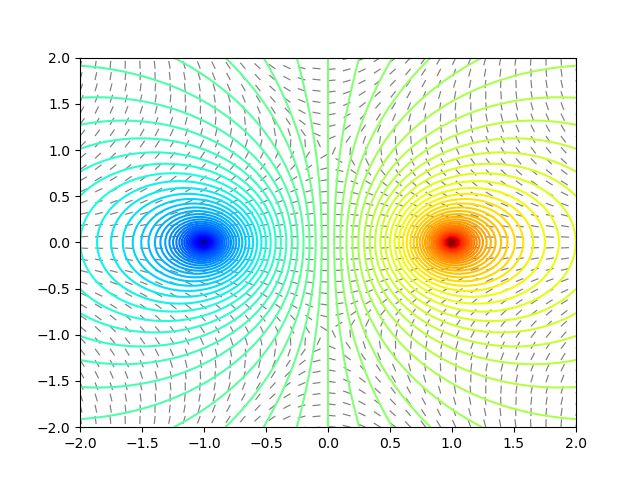

Poisson's equation in a domain $$\Omega\subseteq\mathbb{R}^2$$ is given by

$$u_{xx} + u_{yy} = \rho(x,y),\ \ (x,y)\in\Omega.$$

##  Electric and Gravitational Fields

Poisson equation comes directly from physics, when studying gravitational and electrical fields.
If $$\rho$$ represents the mass density or charge density, then the solution of Poisson's equation is (up to a constant) equal to the gravitational or electric potential energy in space.

To see this explicitly, let's imagine we place an electron and a proton on an uncharged table a little bit apart.  After imposing a coordinate system and rescaling, we can describe this mathematically as a charge density function given by

$$\rho(x,y) = -\delta(x-1)\delta(y) + \delta_1(x+1)\delta(y).$$

As we will see later, a solution of Poisson's equation in $$\mathbb{R}^2$$ with this electric potential is given by

$$u(x,y) = -\ln((x-1)^2+y^2) + \ln((x+1)^2+y^2).$$

The gradient of this is (up to a constant) the force that would be felt by a charged particle at each position in the plane.

The python code used to generate these visuals can be found here
* [code to visualize solution](python/016-dipole.py)

You can conduct a physical experiment that will allow you to see the same sort of structure.
If we mix some rice seeds in mineral oil and then introduce an electric charge, the seeds arrange themselves in the same pattern as the electric field.



