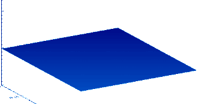

The one-dimensional **wave equation** is

$$\frac{\partial^2 u}{\partial t^2} = c^2\frac{\partial^2 u}{\partial x^2}.$$

In two dimensions, the equation is

$$\frac{\partial^2 u}{\partial t^2} = c^2\left(\frac{\partial^2 u}{\partial x^2} + \frac{\partial^2 u}{\partial y^2}\right).$$

and three dimensions it is

$$\frac{\partial^2 u}{\partial t^2} = c^2\left(\frac{\partial^2 u}{\partial x^2} + \frac{\partial^2 u}{\partial y^2} + \frac{\partial^2 u}{\partial z^2}\right).$$

In general, it can be expressed as

$$u_{tt} = c^2\Delta u.$$

The constant $$c$$ above is called the **wave speed**.

The wave equation arises naturally in acoustics, electricity and magnetism, and fluid dynamics.
In fact, it can be found in many, many more places since it usually arises naturally whenever one observes oscillation.

### Mass-spring System

Consider a one-dimensional rope made up of thousands of tiny masses connected by springs at positions $$x_1,\dots, x_n$$ in the interval $$[0,L]$$ with nearest-neighbor interactions determined by Hooke's Law.
If $$k$$ is the spring constant of all springs and $$m_k$$ is the mass at position $$x_k$$, then the combined forces on the $$j$$'th mass is

$$m_j\frac{d^2u(x_j,t)}{dt^2} = k(u(x_{j+1},t)-u(x_j,t))-k(u(x_j,t)-u(x_{j-1},t)) = k(u(x_{j+1},t)-2u(x_j,t)+u(x_{j-1},t)),$$

where here $$u(x_j,t)$$ measures the distance of mass $$j$$ from its equilibrium point.
Taking the limit as we add more and more masses and make the distance beween them become smaller and smaller, the discrete function $$u(x_j,t)$$ may be approximated with a continuous function $$u(x,t)$$ and the right-hand side of the above equation is the second derivative of $$u$$ with respect to $$x$$:

$$m\frac{d^2u}{dt^2} = k\frac{d^2u}{dx^2},$$

which is the wave equation with $$c = \sqrt{k/m}$$.

### Shallow water equations

The **shallow water equations** are the system of three equations

$$u_t + uu_x + vu_y = -gh_x$$

$$v_t + uv_x + vv_y = -gh_y$$

$$h_t + ((H+h)u)_x + ((H+h)v)_y = 0$$

where here $$u(x,y,t)$$ and $$v(x,y,t)$$ are the velocity of the fluid in the $$x$$ and $$y$$ directions at position $$(x,y)$$ and time $$t$$.
The value of $$H$$ is the mean height of the water and $$h(x,y,t)$$ is the displacemnt of the height of the fluid relative to $$H$$ at position $$(x,y)$$ and time $$t$$.
The value $$g$$ is the gravitational acceleration.

This is a nonlinear system of equations in $$x,y$$ and $$h$$, since the unknown functions end up multiplying one-another.
We **linearize** the system by making the assumption that $$u,v$$ and $$h$$ are small, so that the square terms $$uu_x, uh_x, hu_x, vu_y$$ and so on are negligibly small relative to the other terms in the system.
This gives us a linear system of equations

$$u_t = -gh_x$$

$$v_t = -gh_y$$

$$h_t + Hu_x + Hv_y = 0.$$

Putting this together, we obtain

$$h_{tt} + Hu_{xt} + Hv_{yt} = 0,$$

which gives us

$$h_{tt} = \frac{H}{g}\left( h_{xx} + h_{yy} \right).$$

Thus the wave equation in two dimensions gives a good approximation of the value of $$h(x,y,t)$$ for the shallow water equations with small values of $$x,y$$, and $$h$$.

